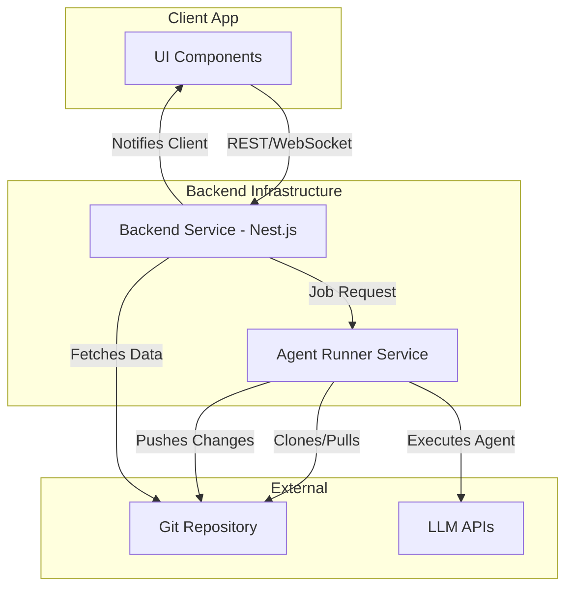

# Online Mode Architecture

This document outlines the high-level architecture for enabling online, collaborative features in the Dev-Agent application. The core idea is to introduce a backend system that orchestrates project state and agent execution, using a Git repository as the single source of truth for project data.

## 1. Guiding Principles

- **Git as the Source of Truth**: All project data (tasks, features, code) is stored in a Git repository. The backend and clients clone and interact with this repository. This simplifies data synchronization and allows developers to use standard Git workflows.
- **Offline-First Client**: The existing Electron application must remain fully functional in a local-only (offline) mode. The online mode is an enhancement, not a replacement.
- **Service-Based Architecture**: The backend is split into a primary service for API/WebSocket communication and a separate service for executing agents. This separation allows for independent scaling and resource management of agent execution.
- **Shared Protocol**: A shared library will define the data structures and types for communication between the client and backend, ensuring type safety and consistency.

## 2. System Components

The online mode consists of three main components, distributed across separate repositories.

### a. Dev-Agent Backend

- **Description**: A Nest.js application that serves as the main entry point for clients. It manages access to projects (Git repositories), handles user authentication (future), and orchestrates agent runs.
- **Responsibilities**:
    - Exposing a REST API for project management (e.g., listing projects, viewing tasks/features).
    - Providing a WebSocket endpoint for real-time updates (e.g., agent progress, file changes).
    - Authenticating users and authorizing access to repositories.
    - Delegating agent execution requests to the Agent Runner service.
    - Caching and indexing repository data for performance (e.g., using a local database).
- **Technology Stack**:
    - **Framework**: Nest.js (TypeScript)
    - **Communication**: REST, WebSockets

### b. Dev-Agent Runner

- **Description**: A micro-service responsible for executing agent tasks. It receives a job from the backend, clones the specified project repository, runs the agent using the `factory-ts` library, and streams progress back to the backend.
- **Responsibilities**:
    - Managing a queue of agent execution jobs.
    - Isolating agent runs in secure, temporary environments (e.g., Docker containers).
    - Cloning the correct version of the project repository.
    - Executing the agent and capturing logs, file changes, and status updates.
    - Pushing resulting code changes back to the Git repository.
    - Streaming real-time updates via the backend's WebSocket.
- **Deployment**: Can be deployed as a separate process or container, potentially on different infrastructure optimized for compute tasks. It can be part of the backend repository for simplicity to start.

### c. Dev-Agent Shared Library

- **Description**: An NPM package containing shared code, primarily TypeScript types and interfaces, for communication between the backend and the client.
- **Responsibilities**:
    - Defining the data transfer objects (DTOs) for REST API and WebSocket payloads.
    - Containing reusable validation logic or constants.
- **Technology Stack**:
    - **Language**: TypeScript
    - **Package Manager**: NPM/Yarn

### d. Dev-Agent Client (This Application)

- **Description**: The existing Electron application, which will be updated to act as a client to the backend services.
- **Responsibilities**:
    - A new "mode selection" interface (Local vs. Online).
    - In "Online Mode":
        - Authenticating with the backend.
        - Fetching project lists and data from the backend API.
        - Subscribing to WebSocket for real-time updates.
        - Sending requests to the backend to run agents.
        - Displaying read-only views of agent progress while the backend runs them.
    - In "Local Mode":
        - The application functions as it does today, directly interacting with the local filesystem and running agents in a local process.

## 3. Repository & Project Plan

We will create two new repositories alongside the existing `dev-agent` repository.

| Repository Name       | Description                                  | Tech Stack              | Initial Scaffolding Plan                                                              |
| --------------------- | -------------------------------------------- | ----------------------- | ------------------------------------------------------------------------------------- |
| `dev-agent-backend`   | Backend service and Agent Runner microservice. | Nest.js, TypeScript     | 1. Initialize a new Nest.js project. 2. Define modules for `Project`, `Auth`, `Agent`. 3. Set up REST and WebSocket gateways. 4. Create a separate module/entrypoint for the Agent Runner. |
| `dev-agent-shared`    | Shared types and interfaces.                 | TypeScript, NPM         | 1. Initialize a new TypeScript project. 2. Define initial interfaces for `Project`, `Task`, `Feature`, `AgentRun`. 3. Publish as a private NPM package. |
| `dev-agent` (existing) | The Electron client application.             | Electron, React, TS     | 1. Add `dev-agent-shared` as a dependency. 2. Implement a service layer to communicate with the backend. 3. Create UI for mode selection and online project browsing. |

## 4. Architecture and Data Flow

The system is designed around Git as the central point of coordination.

**Data Flow for an Agent Run:**

1.  **Client -> Backend**: The user in the client app requests to run an agent on a feature. A request is sent to the Backend's REST API.
2.  **Backend -> Agent Runner**: The Backend validates the request and sends a job to the Agent Runner service. The job contains the Git repository URL, the commit/branch to work on, and the agent task details.
3.  **Agent Runner -> Git Repo**: The Agent Runner clones the repository.
4.  **Agent Runner -> LLM**: The Agent Runner executes the agent logic (using `factory-ts`), which involves making calls to LLM APIs.
5.  **Agent Runner -> Backend**: Progress, logs, and status are streamed back to the Backend, which forwards them to the client via WebSocket.
6.  **Agent Runner -> Git Repo**: Upon successful completion, the Agent Runner commits and pushes the changes to the Git repository.
7.  **Backend -> Client**: The Backend sends a final completion status to the Client.

## 5. Client Mode Selection (Local vs. Online)

The client will need a mechanism to switch between modes.

- **Initial Setup**: On first launch, or from a settings page, the user can configure the application mode.
- **Configuration**: The choice will be stored in a local configuration file. This configuration will include the backend URL if "Online Mode" is selected.
- **Implementation**: A new service layer/module will be introduced in the client. This layer will abstract the data source.
    - When in **Local Mode**, it will use the existing `factory-ts` and file system integrations directly.
    - When in **Online Mode**, it will make API calls to the backend and will not interact with `factory-ts` locally for agent runs.
- **UI Changes**:
    - The project list will be populated from the local file system (Local) or a backend API call (Online).
    - The "Run Agent" button will either trigger a local process or a backend API call depending on the mode.
    - A status indicator in the UI should make it clear which mode is currently active.
