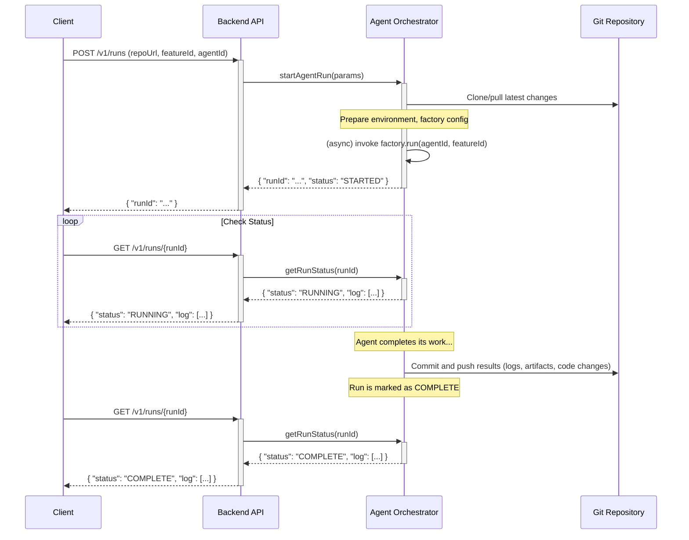
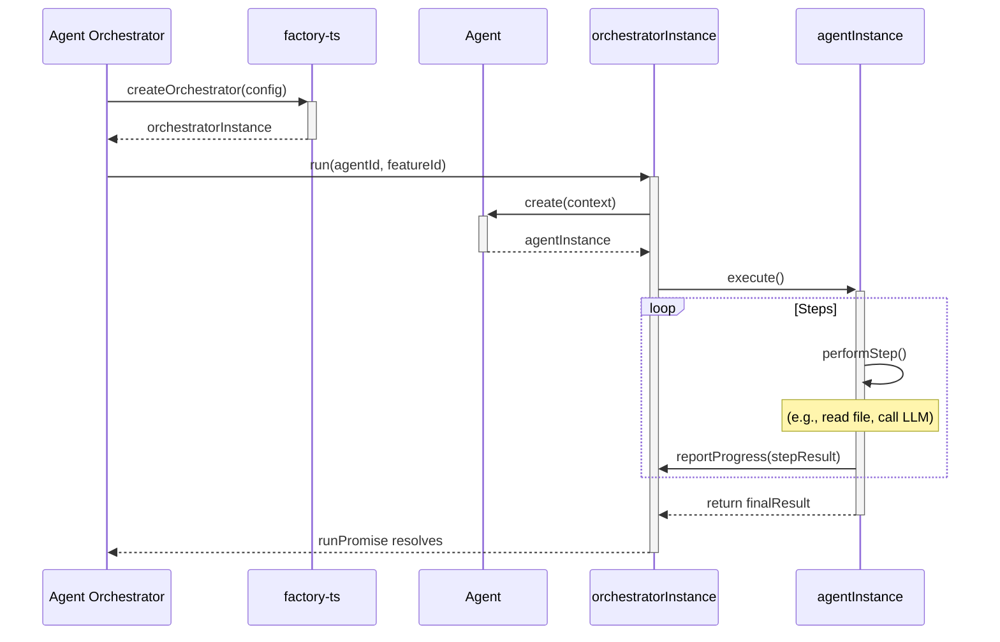

# Backend Agent Orchestrator

This document specifies the design for a thin abstraction layer in the backend responsible for initiating and monitoring agent runs. This orchestrator will leverage the shared `factory-ts` library to manage the agent lifecycle.

## 1. Overview

The Agent Orchestrator acts as the entry point for all agent-related operations requested by clients. It is responsible for:

1.  Receiving agent run requests.
2.  Setting up the correct environment, including models, API keys, and repository access.
3.  Invoking the agent factory from `factory-ts`.
4.  Monitoring the agent's progress.
5.  Serializing the results (logs, artifacts, and state changes) back into the project's Git repository.

This system must be stateless from the perspective of the backend service. All state is to be stored within the customer's repository, which acts as the single source of truth.

## 2. Sequence Diagrams

### 2.1. Client-Backend Interaction (Happy Path)

This diagram shows the flow when a client requests an agent run.

### 2.2. Internal Orchestration using `factory-ts`

This diagram details how the orchestrator uses the shared library.

## 3. Configuration

Configuration will be managed via environment variables on the backend server. The orchestrator service will read these variables to configure the `factory-ts` instance.

### 3.1. Environment Variables

| Variable                 | Description                                                                 | Example                             |
| ------------------------ | --------------------------------------------------------------------------- | ----------------------------------- |
| `ORCHESTRATOR_GIT_USER`    | The Git username for committing results.                                    | `"AI Agent"`                        |
| `ORCHESTRATOR_GIT_EMAIL`   | The Git email for committing results.                                       | `"agent@example.com"`               |
| `ORCHESTRATOR_DATA_DIR`    | A temporary directory for cloning repositories.                             | `/tmp/agent_runs`                   |
| `OPENAI_API_KEY`         | API key for OpenAI models.                                                  | `sk-...`                            |
| `ANTHROPIC_API_KEY`      | API key for Anthropic models.                                               | `sk-ant-...`                        |
| `MODEL_PRICING_CONFIG_PATH` | Path to a JSON file defining model pricing. Defaults to factory settings. | `/app/config/model-pricing.json`    |

### 3.2. Project-Specific Configuration

Any configuration specific to a project (e.g., which model to use, agent settings) **must** reside within that project's repository. The backend is generic and does not store project-specific settings.

The `factory-ts` library is already designed to read configuration from `.aispec/config.json` within the repository. The backend orchestrator will rely on this mechanism.

## 4. Model, Pricing, and History Management

-   **Models**: The backend will be configured with API keys for various LLM providers. The `factory-ts` library will handle the logic of selecting the appropriate client based on the model requested in the project's config.
-   **Pricing**: The `factory-ts` library contains a pricing service. The backend can override the default pricing data by providing a path to a custom pricing file via the `MODEL_PRICING_CONFIG_PATH` environment variable. This allows the backend operator to centrally manage and update pricing information.
-   **History**: Agent run history (prompts, responses, tool calls) is managed by `factory-ts`. It is responsible for logging this data into the appropriate files within the `.aispec/history` directory of the repository.

## 5. Run Results Serialization

Upon completion of an agent run, the orchestrator must ensure all outputs are serialized back to the repository.

### 5.1. Outputs

The following artifacts will be generated or modified by a run:

-   **Source Code**: Any modified or created source files.
-   **Logs**: A detailed log of the agent's execution, including thoughts, tool calls, and LLM interactions. This will be stored in `.aispec/history/{runId}.log`.
-   **State Files**: Updates to the project's task or feature files (e.g., `*.feature.md`).

### 5.2. Git Workflow

1.  **Start**: Before a run, the orchestrator pulls the latest changes from the remote repository.
2.  **Execution**: The agent performs its work on the local clone.
3.  **Completion**: After the run, the orchestrator performs the following Git operations:
    -   `git add .`
    -   `git commit -m "feat: Agent run {runId} for feature {featureId}"`
    -   `git push`

This ensures that every agent run is an atomic commit, providing a clear and auditable history.
