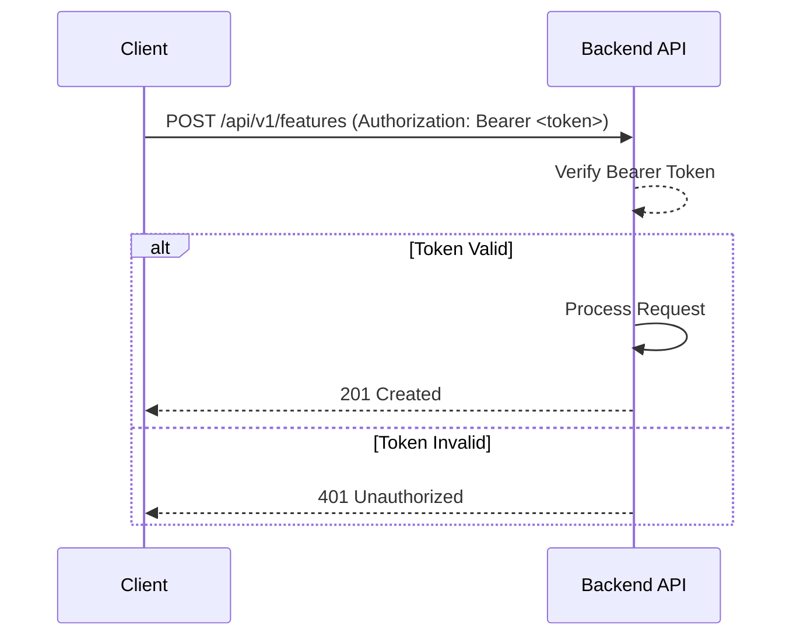
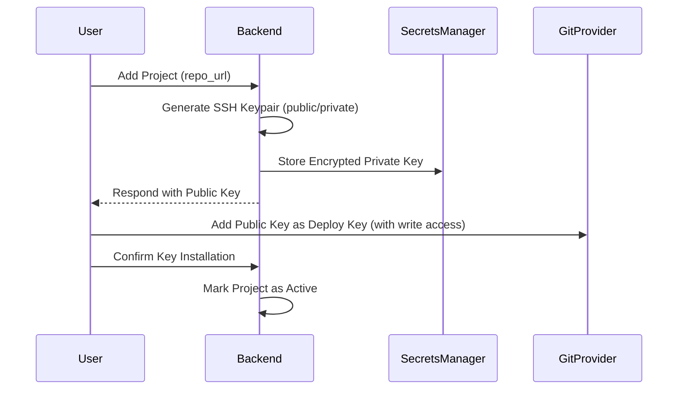
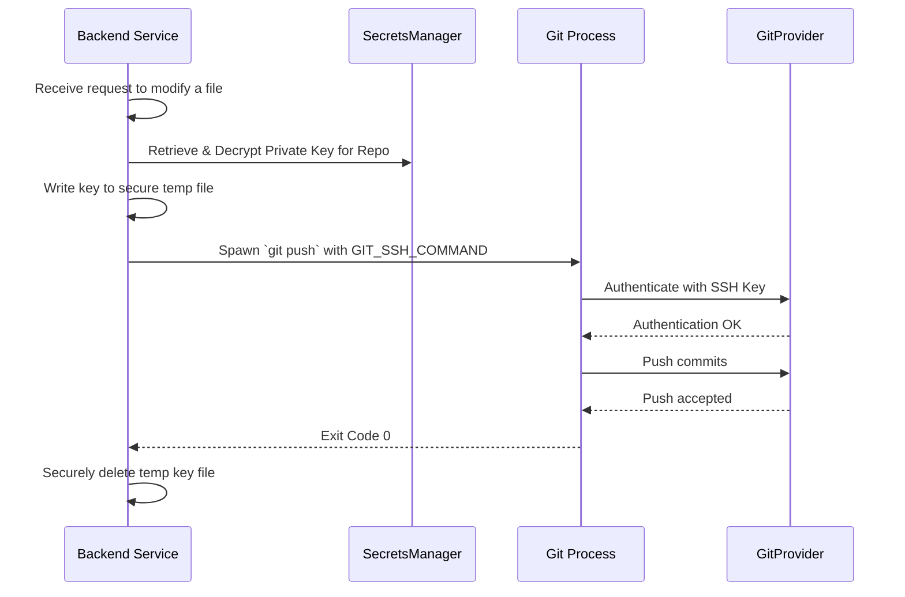

# Backend Authentication and Repository Access Strategy

This document outlines the strategy for client authentication and Git repository access for the backend service. The goal is to provide a secure and flexible system that allows clients (both local and remote) to interact with project data stored in Git repositories via the backend.

## 1. Client Authentication

Clients will authenticate with the backend using a token-based system.

### 1.1. Token Mechanism

-   **Type**: Personal Access Tokens (PATs) will be issued to clients (e.g., the desktop app, CLI tools).
-   **Format**: Tokens will be secure, random strings with a prefix for identifiability.
-   **Transport**: Clients must send the token in the `Authorization` HTTP header with the `Bearer` scheme on every API request.

    ```
    Authorization: Bearer <your-personal-access-token>
    ```

### 1.2. Token Lifecycle

-   **Issuance**: Users will generate tokens through a secure backend endpoint or UI (to be built).
-   **Permissions/Scopes**: Tokens can be scoped with permissions (e.g., `read:projects`, `run:agents`) to limit their capabilities. For the MVP, a single scope for full access is sufficient.
-   **Revocation**: Users must be able to revoke tokens at any time.
-   **Storage**: Clients are responsible for securely storing their tokens.

## 2. Repository Access Strategy

The backend needs to access Git repositories on behalf of users to manage project data. The core principle is that the backend holds credentials for each project repository it manages.

### 2.1. Credential Model

-   **Per-Project Credentials**: Access to each Git repository is managed independently. The backend will store a dedicated credential (SSH key or access token) for each repository.
-   **Mechanism**: SSH Deploy Keys are the preferred method. They can be configured with read-only or read-write access directly on the Git provider (e.g., GitHub, GitLab).
    -   **Read-Write Keys**: Required for the backend to push changes (e.g., updating tasks, features).
    -   **Fine-grained Tokens**: As an alternative, Git provider tokens (like GitHub's Fine-Grained Personal Access Tokens) can be used if they can be scoped to a single repository.

### 2.2. Credential Storage and Security

-   **Encryption at Rest**: All sensitive credentials (SSH private keys, tokens) **MUST** be encrypted at rest in the backend's database or a dedicated secrets manager (e.g., HashiCorp Vault, AWS KMS).
-   **Access Control**: The backend service must have strict internal controls to ensure credentials are only ever decrypted in memory just-in-time for a Git operation.
-   **Rotation**: A mechanism for rotating credentials should be implemented. For deploy keys, this means generating a new keypair, updating the Git provider, and replacing the key in the backend's storage.

### 2.3. Injecting Credentials for Git Processes

The backend will shell out to the `git` CLI for repository operations. Credentials will be injected securely:

-   **For SSH**: The private key will be written to a temporary file with strict permissions (`0600`). The `GIT_SSH_COMMAND` environment variable will be used to point `git` to this key.

    ```bash
    export GIT_SSH_COMMAND="ssh -i /path/to/temp/private_key -o IdentitiesOnly=yes"
    git clone git@github.com:user/repo.git
    # Securely delete the temporary key file immediately after the operation
    ```

-   **For HTTPS**: If using tokens, they can be embedded in the remote URL. This is less secure as the token might be logged. A better approach is to use a Git credential helper configured on-the-fly for the specific process.

## 3. Roles and Permissions (MVP)

User permissions are defined at the project level.

-   **Reader**: Can view project details, tasks, and features. Has read-only (clone/pull) access to the repository via the backend.
-   **Editor**: All `Reader` permissions, plus the ability to create and modify projects, tasks, and features. Requires read-write (push) access to the repository.
-   **Runner**: All `Editor` permissions, plus the ability to launch agent runs on a project.

## 4. Sequence Diagrams

### 4.1. Client API Request



### 4.2. Adding a New Project Repository



### 4.3. Backend Pushing a Change to Git



## 5. Security Considerations

-   **Principle of Least Privilege**: Deploy keys and tokens **MUST** be scoped to the single repository they are for. Avoid using user-level credentials.
-   **Credential Leakage**: Ensure that raw credentials or sensitive file paths are never logged or exposed in API responses or agent run outputs.
-   **Transport Security**: All communication between clients and the backend, and between the backend and Git providers, **MUST** use TLS (HTTPS/SSH).
-   **Input Sanitization**: The backend must sanitize all inputs, especially repository URLs, to prevent command injection attacks when interacting with `git`.
-   **Auditing**: All actions, especially those involving repository access or modification, should be logged for security auditing.
